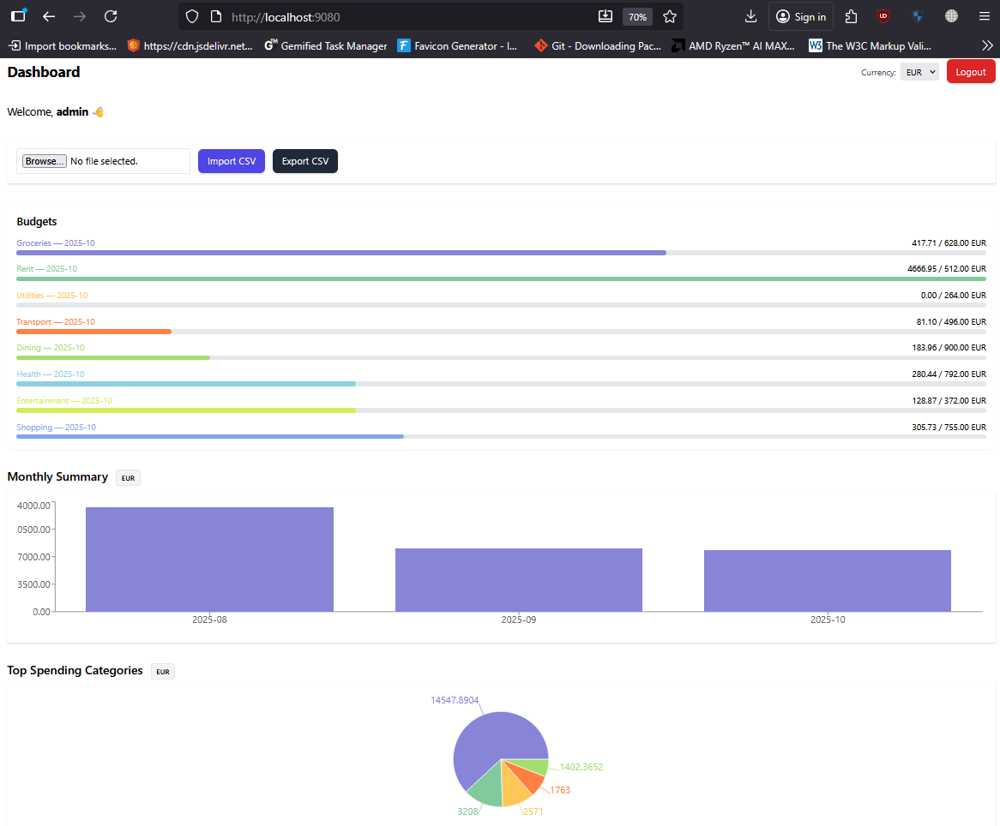
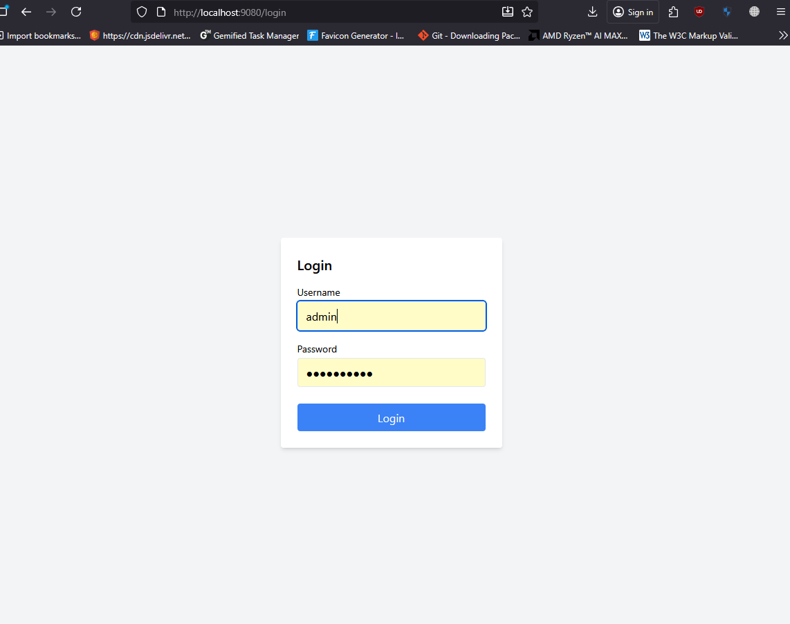
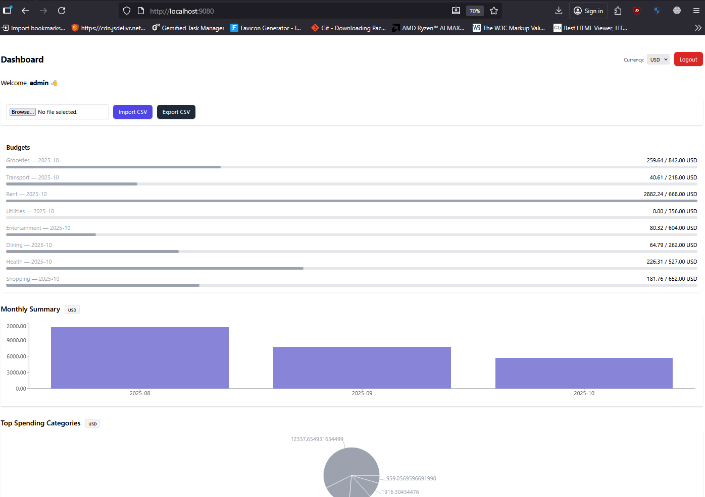
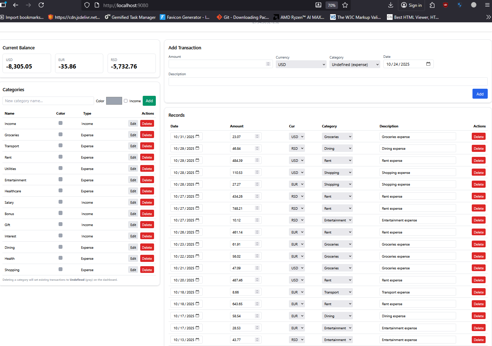
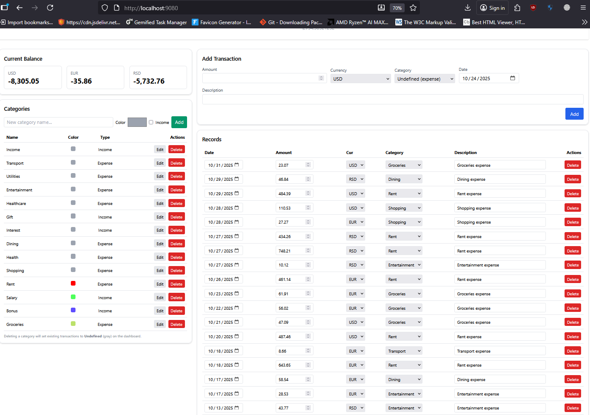
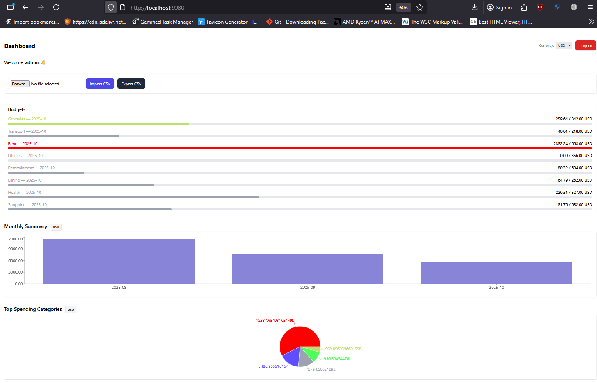

# Personal Finance Tracker+


## Preview








# Quick start

```bash
docker compose build
docker compose up -d
```

# Apply migrations & create the superuser (The .env file already contains default admin credentials — you can create the same user manually if needed.)

```bash
docker compose exec backend python manage.py makemigrations
docker compose exec backend python manage.py migrate
docker compose exec backend python manage.py createsuperuser
```
# Seed Demo Data

```bash
docker compose exec backend python manage.py seed_basics
docker compose exec backend python manage.py seed_fx --days 90 --usd-eur 0.92 --usd-rsd 108.5
docker compose exec backend python manage.py seed_demo --user admin --months 3 --tx-per-month 60
```
# Open the app
Login - http://localhost:9080/login default admin creds from .env
Dashboard - http://localhost:9080/ real-time analytics, CSV import/export


# Service - Purpose
- `backend` - Django REST API (transactions, analytics, auth)
- `nginx` - Serves built React frontend + proxies /api/ to backend
- `db` - PostgreSQL database
- `redis` - Message broker for Celery
- `worker` - Celery worker – processes async jobs (`rate sync`, `imports`)
- `beat` - Celery beat – schedules nightly `sync_rates_task`
- If you skip `worker/beat`, the app still runs; rates sync on boot only.

# Notes

- CSV import/export is available directly on the Dashboard.
- All static/media assets are served via Nginx with gzip caching.
- For local development, SECURE_SSL_REDIRECT=False to avoid 301 HTTPS redirects.
- Default login credentials are in your .env file.

# TODOs:
- Add inital balance edit endpoints + func with buttons (back and front)
- Move editable categories and records to another page
- Make non editable copy of the records at the dashboard
- Change seed demo values to more realistic one
- Make preset for initial categy colors

© 2025 — Personal Finance Tracker+